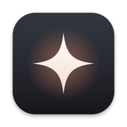
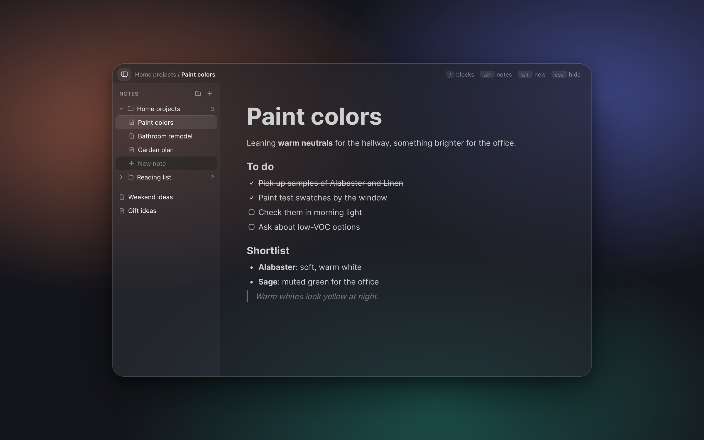

<div align="center">



# After Thought

**Quick notes for your Mac, with Notion-style blocks.**<br>
Open-source quick notes for productive people.




</div>

## Features

- **Always one shortcut away.** `⌘⇧Space` opens your last note from anywhere; press it again to hide.
- **Notion-style blocks.** Type `/` for headings, checklists, bullet and numbered lists, quotes, code blocks, and more.
- **Folders.** A resizable sidebar with folders; drag notes between them.
- **Quick switcher.** `⌘P` to search every note.
- **Built for your Mac.** A menu bar app with a Liquid Glass window that stays put when you click away, fading back so it's out of your way.
- **Hand notes to Claude.** Right-click a note or folder and choose **Copy for Claude** to paste it as a `.md` attachment.
- **Your notes, as files.** Optionally keep a Markdown copy of every note in a folder you choose, with real folders to match.

## Install

There's no download yet, so build it from source. You need:

- macOS 26 (it's only been tested there so far; older versions should get a plain blurred window instead of Liquid Glass, but that hasn't been tried)
- Xcode with the macOS 26 SDK
- Node.js 20.19 or newer

```bash
git clone https://github.com/dizzyjaguar/after-thought.git
cd after-thought
./scripts/build.sh
open build/after-thought.app
```

After Thought lives in the menu bar (look for ✦); there's no Dock icon. To start it when you log in, choose **Launch at Login** from that menu.

## Shortcuts

| Keys | What it does |
| --- | --- |
| `⌘⇧Space` | Show or hide the window, opening your last note |
| `⌃⌥N` | New note, from anywhere |
| `/` | Block menu: headings, lists, checklists, code, … |
| `⌘T` or `⌘N` | New note |
| `⌘P` | Search notes (`⌘⌫` deletes the selected one) |
| `⌘\` | Show or hide the sidebar |
| `⌘⇧C` | Copy the open note for Claude |
| `⌘Z` / `⌘⇧Z` | Undo / redo |
| `esc` | Hide the window |

In the sidebar, right-click a note or folder, or use its **⋮** button, to copy, rename, or delete it.

## Where your notes live

- Notes are saved in `~/Library/Application Support/after-thought/`.
- **Markdown copy (optional):** menu bar ✦ → **Markdown Copy** → **Keep a Markdown Copy…**, then pick a folder. After Thought keeps `After Thought/<Folder>/<Note>.md` up to date as you type. The copy is one way: edit your notes in the app, since changes made to the `.md` files get replaced.

## Development

After Thought is two parts that talk to each other:

| Folder | What's inside |
| --- | --- |
| `web/` | The editor: React + [BlockNote](https://www.blocknotejs.org), built with Vite |
| `mac/` | The app: Swift/AppKit for the window, hotkeys, menu bar, and saving notes |
| `scripts/build.sh` | Builds both and puts them together into `build/after-thought.app` |

To work on the editor with live reload, run the dev server and point the app at it:

```bash
npm --prefix web install
npm --prefix web run dev
AFTER_THOUGHT_DEV_URL=http://localhost:5173 build/after-thought.app/Contents/MacOS/AfterThought
```

The editor also runs on its own in a browser at `http://localhost:5173`, saving to the browser's storage instead of the Mac.

Commits follow [Conventional Commits](https://www.conventionalcommits.org) (`feat:`, `fix:`, `chore:`, …).

## Credits

- Editor: [BlockNote](https://www.blocknotejs.org)
- Menu bar icon: [SF Symbols](https://developer.apple.com/sf-symbols/)

## License

[MIT](LICENSE)
